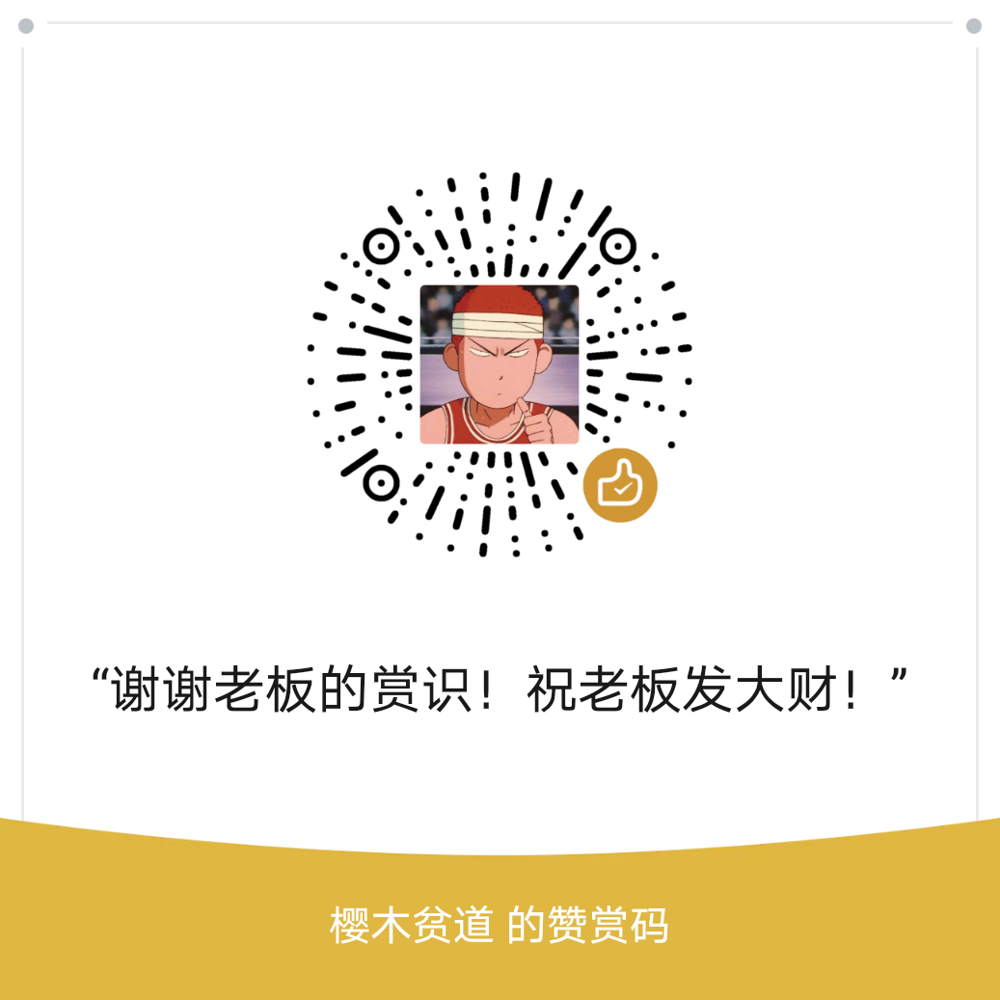

# 👋 Hello World! 我是Colton

## 关于我

- 💻 全栈开发学习者 | 产品经理
- 🎮 英雄联盟资深大乱斗玩家 | 电竞爱好者
- 📚 终身学习者 | 技术狂热粉

## 技术栈

- 🌱 Spring Boot (Java后端框架)
- 🖥 Vue.js (前端框架)
- 🗃 MySQL (数据库)
- 📱 基础产品设计

## 职业目标

> "从开发者视角出发，成为懂技术的产品经理"

- ✨ 希望将技术背景与产品思维结合
- 🏆 致力于打造用户喜爱的数字产品

## 联系我

- LinkedIn: [Colton](https://www.linkedin.com/in/colton-teng-916419265/)

## GitHub 数据

## 感谢投喂

